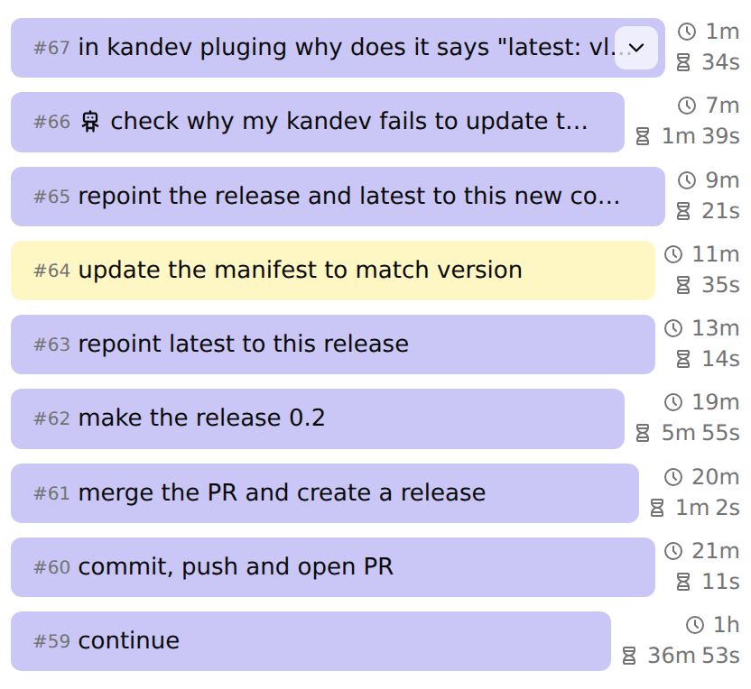

# Prompt History — a kandev plugin

A [kandev](https://github.com/kdlbs/kandev) native-UI plugin that adds a
**Prompt History** task panel: every prompt you sent in the active session, newest
first, in a scrollable list you can read at a glance and jump back into.

## What the panel does

- **Every prompt, numbered.** Each row shows the prompt's `#N` ordinal, its text,
  and its bubble styled exactly like the transcript's user message.
- **Send age and agent work time.** The `#N` row's right column shows how long ago
  the prompt was sent (`1m`, `5h`, `3d` — the same compact ladder as the shipped
  panel) and how long the agent worked on it (`34s`, `1m 39s`, `36m 53s`).
- **Long prompts read in place.** A prompt whose text overflows gets an expand
  control: it opens into a scrollable box without leaving the panel.
- **Favorites stand out.** Prompts you starred in the transcript carry the same
  highlight here.
- **Agent-sent prompts are marked.** A row whose prompt came from another task's
  agent shows the robot glyph, so mixed sessions stay readable.
- **Click through to the transcript.** Clicking a row navigates to that prompt in
  the conversation.
- **Older prompts load as you scroll.** The panel pages through history on its own
  — and stops once it reaches your first prompt.
- **Stays in sync.** Live messages, deletions and favorites update the list as they
  happen; nothing needs a refresh.
- **Desktop and phone.** Available from the desktop add-panel (`+`) menu and the
  mobile Panels picker.
- **Localized.** `en`, `pt-pt`, `zh-cn`, `zh-hk`, `zh-tw`, and a `pseudo` QA locale.

## Install

kandev **0.95.0 or newer**, with the `plugins` feature enabled.

1. **Settings > Plugins**, then install **Prompt History** from the marketplace —
   or upload/point at the release package
   (`kandev-plugin-prompt-history-1.0.0.tar.gz`).
2. Open a task's panel menu and pick **Prompt History**.

To install against a running instance from the command line, see
[packaging and releases](docs/packaging-and-releases.md).

## How it works

It is a *native-UI plugin*: a browser-side panel registered through kandev's
public plugin contracts, plus a no-op Go backend that exists only for the
go-plugin handshake. No host patches, no private stores, no duplicated
transport.

- **Least privilege.** The manifest declares only
  `capabilities.api_read: ["messages"]`; the panel reads the active session's
  conversation through `host.conversation` and nothing else. No events, state,
  secrets, or write access.
- **No-op backend.** `server/` embeds `pluginsdk.UnimplementedPlugin` and
  overrides no RPCs — the conversation facade needs no backend logic.
- **Parity by construction.** Rows mirror the shipped core panel: same bubble
  styling (including the host's `markdown-body` classes), same Tabler glyphs, same
  compact time ladder, same pointer-dependent row heights.
- **Self-sufficient styling.** `ui/plugin.css` owns every `ph-plugin-*` class the
  panel renders, uses the host's theme tokens, and is re-pointed at the running
  bundle's version so an update can never render with a previous release's CSS.

Full design contract:
[docs/specs/plugins/system-design/prompt-history-plugin.md](docs/specs/plugins/system-design/prompt-history-plugin.md).

## Documentation

| | |
|---|---|
| [Development](docs/development.md) | layout, SDK sibling-checkout setup, build and test targets |
| [Packaging, install, and releases](docs/packaging-and-releases.md) | packaging, host-version floor, release workflow |
| [System design](docs/specs/plugins/system-design/prompt-history-plugin.md) | the panel's contracts and parity rules |
| [Plan](docs/plans/prompt-history-plugin/plan.md) | how the plugin was planned and built |
| [Changelog](CHANGELOG.md) | release history |

## Provenance

The plugin was entirely designed and written by a local Qwen 3.8 27B IQ3 XXS
model, derived from an existing internal implementation rather than implemented
from scratch.

## License

MIT — see [LICENSE](LICENSE).
