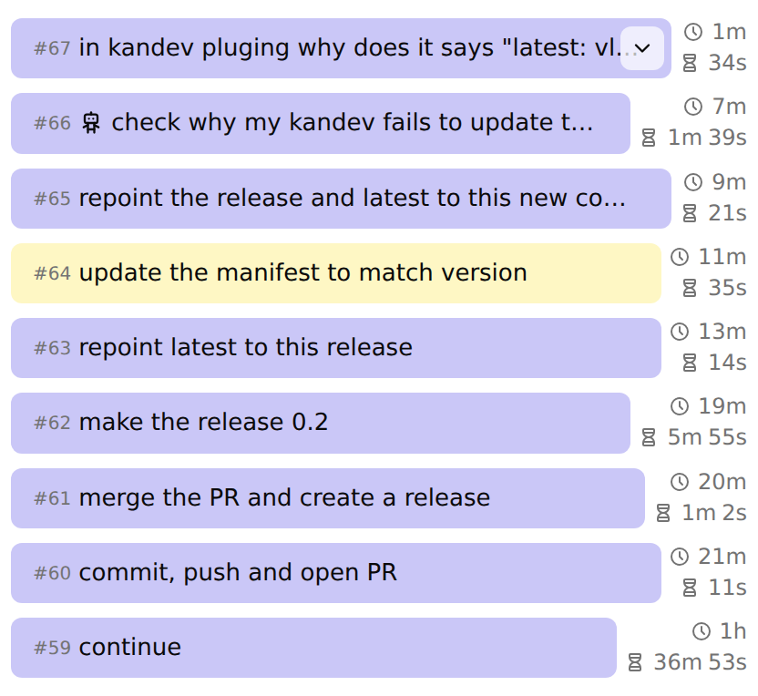

# Prompt History — a kandev plugin

A [kandev](https://github.com/kdlbs/kandev) native-UI plugin that adds a
**Prompt History** task panel: every prompt you sent in the active session, newest
first, in a scrollable list you can read at a glance and jump back into.

## What the panel does

- **Every prompt, numbered.** Each row shows the prompt's `#N` ordinal, its text,
  and its bubble styled exactly like the transcript's user message.
- **Send age and agent work time.** The `#N` row's right column shows how long ago
  the prompt was sent (`1m`, `5h`, `3d` — the same compact ladder as the shipped
  panel) and how long the agent worked on it (`34s`, `1m 39s`, `36m 53s`).
- **Long prompts read in place.** A prompt whose text overflows gets an expand
  control: it opens into a scrollable box without leaving the panel.
- **Favorites stand out.** Prompts you starred in the transcript carry the same
  highlight here.
- **Agent-sent prompts are marked.** A row whose prompt came from another task's
  agent shows the robot glyph, so mixed sessions stay readable.
- **Click through to the transcript.** Clicking a row navigates to that prompt in
  the conversation.
- **Older prompts load as you scroll.** The panel pages through history on its own
  — and stops once it reaches your first prompt.
- **Stays in sync.** Live messages, deletions and favorites update the list as they
  happen; nothing needs a refresh.
- **Desktop and phone.** Available from the desktop add-panel (`+`) menu and the
  mobile Panels picker.
- **Localized.** `en`, `pt-pt`, `zh-cn`, `zh-hk`, `zh-tw`, and a `pseudo` QA locale.

## Settings

The manifest's `config_schema` gives the panel five operator settings, rendered by
the host at **Settings > Plugins > Prompt History** and stored by the host. Every
default reproduces the panel's original row, so an instance that never saved
settings looks exactly as it always did.

| setting | control | default |
|---|---|---|
| Show prompt send time | switch | on |
| Prompt time format | `relative` / `absolute` | `relative` |
| Show prompt numbering | switch | on |
| Show prompt duration | switch | on |
| Agent prompt style | `normal` / `soft grey` / `hide` | `normal` |

- **The row shows one time format and hovers the other.** With the compact
  relative ladder (`5m`) visible, the hover is the absolute, locale-formatted date
  — the shipped panel's own `title` — and with the absolute text visible (short
  date, short time: `1/1/26, 12:30 AM` in `en`) the hover is the host's relative
  phrase.
- **Hiding both right-edge affordances widens the prompt.** With send time and
  duration off, no meta column is rendered at all, so the bubble uses the full row
  width and its right margin matches its left.
- **`hide` drops agent-sent prompts from the list** without renumbering the
  remaining prompts (their ordinals are the server's) and without changing how
  pagination walks history. `soft grey` repaints those rows instead; the favorite
  highlight still wins on a prompt that is both agent-sent and favorited.
- **Both selectors are required**, which is what removes the host form's "Not set"
  choice, and the panel reads an absent or unknown value as the default.

The panel reads the stored config once per mount through the host's scoped
`GET /api/plugins/<id>/config` (`ui/src/panel-config.ts`) and never writes it. A
failed or unauthorized read keeps every affordance and surfaces no error, and a
saved change applies the next time the panel mounts (a session or task switch, or
a reload). The keys carry their form position (`display_1_show_time` …
`display_5_agent_style`) because the host renders the schema's keys as they
arrive, sorted — the manifest's `properties` order is not preserved.

## Install

kandev **0.95.0 or newer**, with the `plugins` feature enabled.

1. **Settings > Plugins**, then install **Prompt History** from the marketplace —
   or upload/point at the release package
   (`kandev-plugin-prompt-history-1.0.0.tar.gz`).
2. Open a task's panel menu and pick **Prompt History**.

To install against a running instance from the command line, see
[packaging and releases](docs/packaging-and-releases.md).

## How it works

It is a *native-UI plugin*: a browser-side panel registered through kandev's
public plugin contracts, plus a no-op Go backend that exists only for the
go-plugin handshake. No host patches, no private stores, no duplicated
transport.

- **Least privilege.** The manifest declares only
  `capabilities.api_read: ["messages"]`; the panel reads the active session's
  conversation through `host.conversation` and nothing else — its one other request
  is the plugin-scoped `GET /api/plugins/<id>/config` read behind
  [Settings](#settings), which is not a capability-gated route. No events, state,
  secrets, or write access.
- **No-op backend.** `server/` embeds `pluginsdk.UnimplementedPlugin` and
  overrides no RPCs — the conversation facade needs no backend logic.
- **Parity by construction.** Rows mirror the shipped core panel: same bubble
  styling (including the host's `markdown-body` classes), same Tabler glyphs, same
  compact time ladder, same pointer-dependent row heights.
- **Self-sufficient styling.** `ui/plugin.css` owns every `ph-plugin-*` class the
  panel renders, uses the host's theme tokens, and is re-pointed at the running
  bundle's version so an update can never render with a previous release's CSS.

Full design contract:
[docs/specs/plugins/system-design/prompt-history-plugin.md](docs/specs/plugins/system-design/prompt-history-plugin.md).

## Documentation

| | |
|---|---|
| [Development](docs/development.md) | layout, SDK sibling-checkout setup, build and test targets |
| [Packaging, install, and releases](docs/packaging-and-releases.md) | packaging, host-version floor, release workflow |
| [System design](docs/specs/plugins/system-design/prompt-history-plugin.md) | the panel's contracts and parity rules |
| [Plan](docs/plans/prompt-history-plugin/plan.md) | how the plugin was planned and built |
| [Changelog](CHANGELOG.md) | release history |

## Provenance

The plugin was entirely designed and written by a local Qwen 3.8 27B IQ3 XXS
model, derived from an existing internal implementation rather than implemented
from scratch.

## License

MIT — see [LICENSE](LICENSE).
