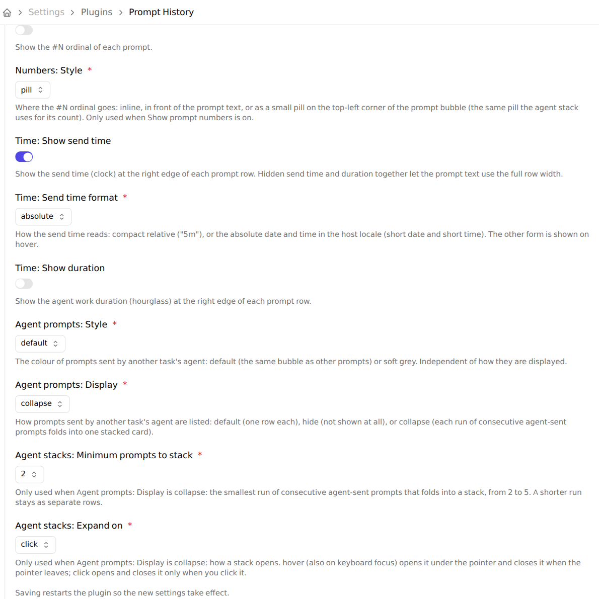
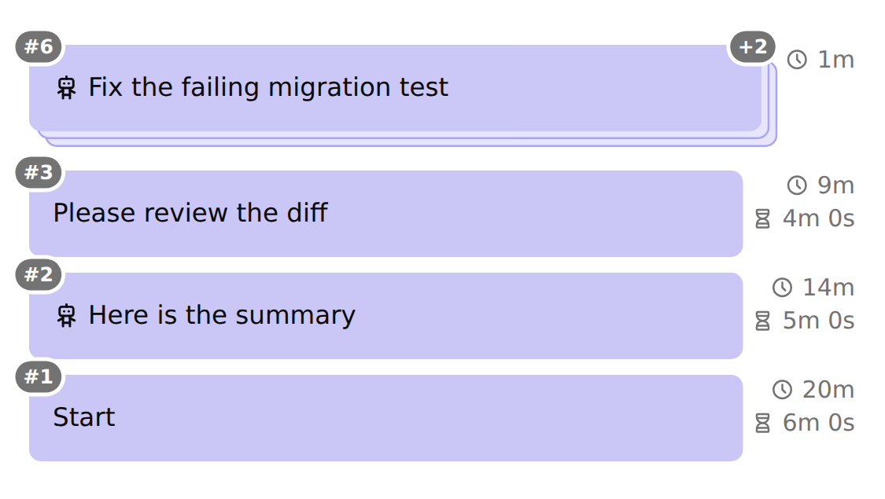
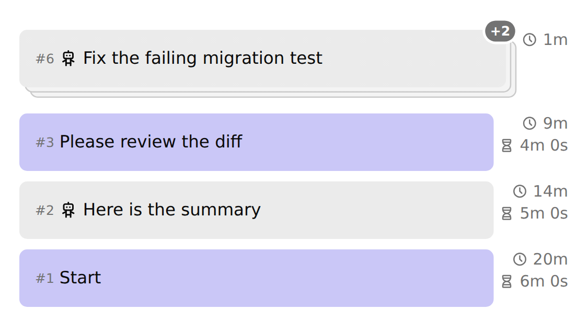
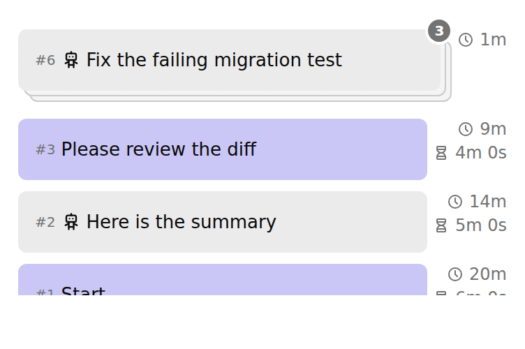
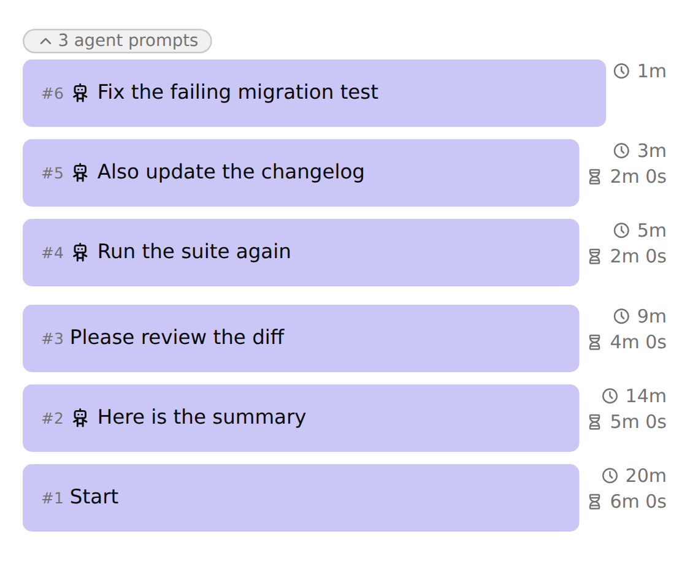

# Prompt History — a kandev plugin

A [kandev](https://github.com/kdlbs/kandev) native-UI plugin that adds a
**Prompt History** task panel: every prompt you sent in the active session, newest
first, in a scrollable list you can read at a glance and jump back into.

## What the panel does

- **Every prompt, numbered.** Each row shows the prompt's `#N` ordinal, its text,
  and its bubble styled exactly like the transcript's user message.
- **Send age and agent work time.** The `#N` row's right column shows how long ago
  the prompt was sent (`1m`, `5h`, `3d` — the same compact ladder as the shipped
  panel) and how long the agent worked on it (`34s`, `1m 39s`, `36m 53s`).
- **Long prompts read in place.** A prompt whose text overflows gets an expand
  control: it opens into a scrollable box without leaving the panel.
- **Favorites stand out.** Prompts you starred in the transcript carry the same
  highlight here.
- **Agent-sent prompts are marked.** A row whose prompt came from another task's
  agent shows the robot glyph, so mixed sessions stay readable.
- **Click through to the transcript.** Clicking a row navigates to that prompt in
  the conversation.
- **Older prompts load as you scroll.** The panel pages through history on its own
  — and stops once it reaches your first prompt.
- **Stays in sync.** Live messages, deletions and favorites update the list as they
  happen; nothing needs a refresh.
- **Desktop and phone.** Available from the desktop add-panel (`+`) menu and the
  mobile Panels picker.
- **Localized.** `en`, `pt-pt`, `zh-cn`, `zh-hk`, `zh-tw`, and a `pseudo` QA locale.

## Settings

The manifest's `config_schema` gives the panel nine operator settings, rendered by
the host at **Settings > Plugins > Prompt History** and stored by the host. Every
default reproduces the panel's original row, so an instance that never saved
settings looks exactly as it always did.

The host's form is a flat list with no sections, so the settings are grouped by
topic two ways: they are listed topic by topic, and every label starts with its
topic (`Numbers: …`, `Time: …`, `Agent prompts: …`, `Agent stacks: …`).

| topic | setting | control | default |
|---|---|---|---|
| Numbers | Show prompt numbers | switch | on |
| Numbers | Style | `inline` / `pill` | `inline` |
| Time | Show send time | switch | on |
| Time | Send time format | `relative` / `absolute` | `relative` |
| Time | Show duration | switch | on |
| Agent prompts | Style | `default` / `soft grey` | `default` |
| Agent prompts | Display | `default` / `hide` / `collapse` | `default` |
| Agent stacks | Minimum prompts to stack | `2` / `3` / `4` / `5` | `2` |
| Agent stacks | Expand on | `hover` / `click` | `hover` |

### Numbers

- **`inline`** puts the `#N` ordinal in front of the prompt text, as the shipped
  panel does. **`pill`** lifts it onto the bubble's top-left corner in the same
  small pill the agent stack uses for its count, so the text gets the whole row.
  The accessible row label (`Prompt N`) is the same either way.

  

### Time

- **The row shows one time format and hovers the other.** With the compact
  relative ladder (`5m`) visible, the hover is the absolute, locale-formatted date
  — the shipped panel's own `title` — and with the absolute text visible (short
  date, short time: `1/1/26, 12:30 AM` in `en`) the hover is the host's relative
  phrase.
- **Hiding both right-edge affordances widens the prompt.** With send time and
  duration off, no meta column is rendered at all, so the bubble uses the full row
  width and its right margin matches its left.

### Agent prompts

Two independent settings, so any colour goes with any display.

- **Style** is the colour of prompts sent by another task's agent: `default` is
  the same bubble as every other prompt, `soft grey` repaints those bubbles (the
  favorite highlight still wins on a prompt that is both agent-sent and
  favorited). The robot glyph marks them either way.
- **Display** is how they are listed: `default` is one row each, `hide` drops
  them from the list without renumbering the remaining prompts (their ordinals
  are the server's) and without changing how pagination walks history, and
  `collapse` folds runs of them into stacks (below).

  

### Agent stacks

These two only matter while the agent prompt display is `collapse`, but the host's
settings form has no way to hide a field behind another field's value, so they
are always listed — their descriptions say when they apply.

- **`collapse` folds each run of consecutive agent-sent prompts into one stacked
  card** — the newest prompt's bubble in front, with two more cards behind it
  that only show along its right and bottom edges, reading as a small deck, and
  a small pill on its top-right corner reading `+n`, the prompts folded in behind
  the front one (`+2` for a run of three). The deck takes the agent prompt
  style's colour. The card is a real `button` with `aria-expanded` and a catalog
  label, so it toggles with Enter/Space. The card's clock and hourglass are the
  front — newest — prompt's own values, and the unfolded rows keep their
  ordinals, robot glyph, long-text expand control, transcript navigation, and
  favorite highlight. Folding never renumbers prompts and never changes
  pagination: paging still keys off every derived row, so a folded run whose
  oldest member is `#1` still stops older-page loading.

  

- **Minimum prompts to stack** sets how long a run must be to fold, from 2 to 5
  (default 2). A shorter run stays as separate rows, still marked as agent
  prompts, with no card.
- **Expand on** picks what unfolds a stack. **`hover`** (default) unfolds it when
  the pointer is over it, and also on keyboard focus or a press, under a slim
  `N agent prompts` header with no time or duration of its own; moving the
  pointer or the focus away folds it back. **`click`** unfolds and folds it only
  when you click it (or press Enter/Space on it): hovering or tabbing over it
  does nothing, and it stays as you left it.

  

- **A tall unfolded run hands the view back when it folds.** If you scroll down
  through an unfolded run and the pointer ends up over the next prompt (or the
  run folds for any other reason), the list scrolls back so the folded card and
  the next non-agent prompt sit exactly where they did before you unfolded it,
  rather than leaving you stranded further down the list. Scrolling *up* past
  the run is left alone, and (in `hover` mode) the folded card does not unfold
  again until the pointer actually moves.

### Required selectors

All six selectors are required, which is what removes the host form's "Not set"
choice, and the panel reads an absent or unknown value as the default.

The panel reads the stored config once per mount through the host's scoped
`GET /api/plugins/<id>/config` (`ui/src/panel-config.ts`) and never writes it. A
failed or unauthorized read keeps every affordance and surfaces no error, and a
saved change applies the next time the panel mounts (a session or task switch, or
a reload). The keys carry their form position (`display_1_show_numbers` …
`display_8_agent_stack_expand`) because the host renders the schema's keys as they
arrive, sorted — the manifest's `properties` order is not preserved.

## Install

kandev **0.95.0 or newer**, with the `plugins` feature enabled.

1. **Settings > Plugins**, then install **Prompt History** from the marketplace —
   or upload/point at the release package
   (`kandev-plugin-prompt-history-1.4.0.tar.gz`).
2. Open a task's panel menu and pick **Prompt History**.

To install against a running instance from the command line, see
[packaging and releases](docs/packaging-and-releases.md).

## How it works

It is a *native-UI plugin*: a browser-side panel registered through kandev's
public plugin contracts, plus a no-op Go backend that exists only for the
go-plugin handshake. No host patches, no private stores, no duplicated
transport.

- **Least privilege.** The manifest declares only
  `capabilities.api_read: ["messages"]`; the panel reads the active session's
  conversation through `host.conversation` and nothing else — its one other request
  is the plugin-scoped `GET /api/plugins/<id>/config` read behind
  [Settings](#settings), which is not a capability-gated route. No events, state,
  secrets, or write access.
- **No-op backend.** `server/` embeds `pluginsdk.UnimplementedPlugin` and
  overrides no RPCs — the conversation facade needs no backend logic.
- **Parity by construction.** Rows mirror the shipped core panel: same bubble
  styling (including the host's `markdown-body` classes), same Tabler glyphs, same
  compact time ladder, same pointer-dependent row heights.
- **Self-sufficient styling.** `ui/plugin.css` owns every `ph-plugin-*` class the
  panel renders, uses the host's theme tokens, and is re-pointed at the running
  bundle's version so an update can never render with a previous release's CSS.

Full design contract:
[docs/specs/plugins/system-design/prompt-history-plugin.md](docs/specs/plugins/system-design/prompt-history-plugin.md).

## Documentation

| | |
|---|---|
| [Development](docs/development.md) | layout, SDK sibling-checkout setup, build and test targets |
| [Packaging, install, and releases](docs/packaging-and-releases.md) | packaging, host-version floor, release workflow |
| [System design](docs/specs/plugins/system-design/prompt-history-plugin.md) | the panel's contracts and parity rules |
| [Plan](docs/plans/prompt-history-plugin/plan.md) | how the plugin was planned and built |
| [Changelog](CHANGELOG.md) | release history |

## Provenance

The plugin was entirely designed and written by a local Qwen 3.8 27B IQ3 XXS
model, derived from an existing internal implementation rather than implemented
from scratch.

## License

MIT — see [LICENSE](LICENSE).
