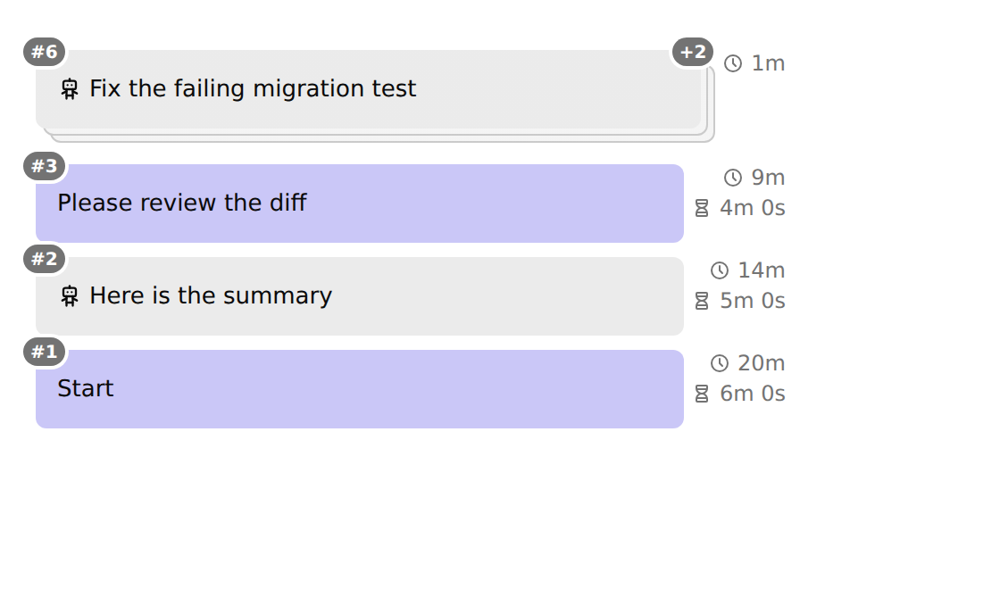
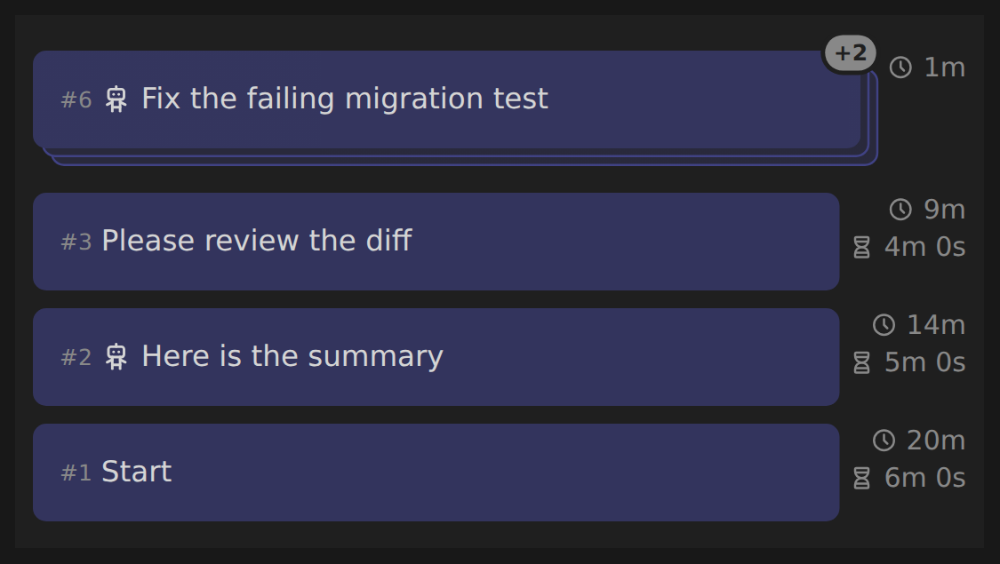

# Prompt History screenshots

These screenshots show the panel under different settings. They were rendered in Chromium from the packaged UI bundle against the host stylesheet and theme tokens, using representative synthetic prompt history; they are visual examples, not a live agent session.

The stack count shows the number of prompts behind the front card (`+2` means three prompts total). Prompt number pills appear on the top-left; the stack count pill appears on the top-right.

## Agent prompt color and display

### Default style + collapse

Options: **Agent prompts: Style** = `default`; **Agent prompts: Display** = `collapse`; **Numbers: Style** = `inline`; **Agent stacks: Expand on** = `hover`.

### Soft grey style + collapse

Options: **Agent prompts: Style** = `soft grey`; **Agent prompts: Display** = `collapse`; **Numbers: Style** = `inline`.

### Soft grey style + pill numbers + collapse

This combination shows that prompt color and number placement are independent: the agent prompts and stack deck are soft grey, while every prompt has a top-left number pill.

Options: **Agent prompts: Style** = `soft grey`; **Agent prompts: Display** = `collapse`; **Numbers: Style** = `pill`; **Agent stacks: Expand on** = `hover`.

### Default style + pill numbers

Options: **Agent prompts: Style** = `default`; **Numbers: Style** = `pill`.

## Expanded stack

The front card shows `+n` while folded. In `hover` mode, moving over it expands the consecutive run; in `click` mode, only activating the card (click, Enter, or Space) changes its state. Click mode does not change the expanded layout, so the same visual applies to both settings.

## Other views

### Dark theme

### Settings form

The host form is flat, so topic grouping is shown through key order and topic-prefixed labels: Numbers, Time, Agent prompts, and Agent stacks.

